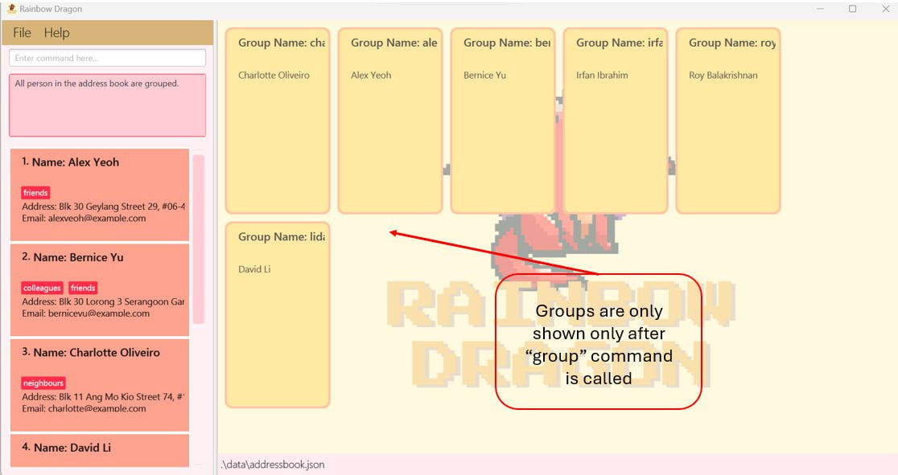
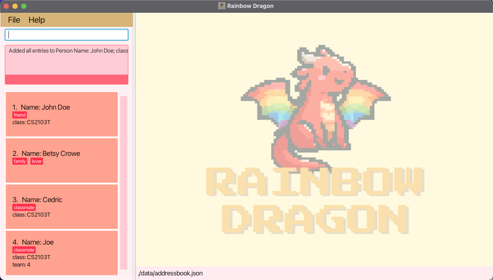
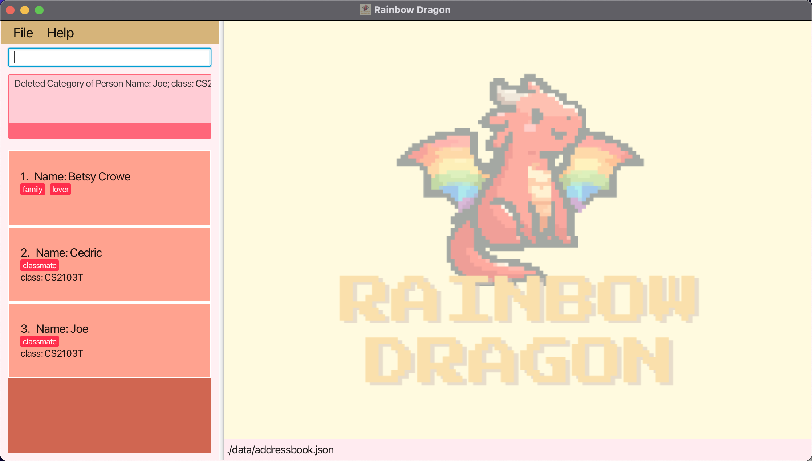

# **Rainbow Dragon User Guide**

Welcome to the Rainbow Dragon User Guide!  
 
If you are:
- Passionate about being the **BEST** player in **ANY** games that you like
- Striving to build an unprecedentedly powerful clan or multiple clans
- Someone who values **camaraderie** and wants to **maintain and manage** good relationships with all your gaming friends
- More used to typing on keyboards than using the mouse  

***Rainbow Dragon*** is just the right application for you!

[Quick start](#quick-start)

[Features](#features)
1. [Viewing help : help](#viewing-the-menu-of-commands-help)
2. [Adding a person: add](#adding-a-person-add)
3. [Adding an entry to a person](#adding-an-entry-to-a-person-addcategory)
4. [Listing all persons : list](#listing-all-persons-list)
5. [Editing a person : edit](#editing-a-person-edit)
6. [Finding person/s : find](#finding-persons-by-category-and-description-or-by-tag-find)
7. [Deleting a person : delete](#deleting-a-person-delete)
8. [Deleting a category of a person : deleteCategory](#deleting-a-category-of-a-person-deletecategory)
9. [Clearing all entries : clear](#clearing-all-entries-clear)
10. [Undoing a command : undo](#undoing-a-command)
11. [Redoing an undo command : redo](#redoing-an-undo-command)
12. [Grouping all persons by Category : group](#group-all-persons-by-category-group)
13. [Exiting the program : exit](#exiting-the-program-exit)

[Saving the data](#saving-the-data)

[Editing the data file](#editing-the-data-file)

[FAQ](#faq)

[Known issues](#known-issues)

[Command summary](#command-summary)

<!-- * Table of Contents -->
<page-nav-print />
--------------------------------------------------------------------------------------------------------------------

## Quick start

1. Ensure you have Java `11` or above installed in your Computer.

1. Download the latest `addressbook.jar` from [here](https://github.com/AY2324S2-CS2103T-W13-3/tp/releases/tag/v1.2).

1. Copy the file to the folder you want to use as the _home folder_ for your AddressBook.

1. Open a command terminal, navigate into the folder you put the jar file in using `cd FILE_PATH`, and use the `java -jar addressbook.jar` command to run the application. 
   A GUI similar to the below should appear in a few seconds if you are a first-time user. Note how the app contains some sample data. 
       The UI below will only be displayed if `group` command is called and the different groups will be displayed as follows:  

1. Type the command in the command box and press Enter to execute it. e.g. typing **`help`** and pressing Enter will open the help window. 
   Some example commands you can try:

   * `list` : Lists all contacts.

   * `add n/John Doe` : Adds a contact named `John Doe` to the Address Book.

   * `delete 3` : Deletes the 3rd contact shown in the current list.

   * `clear` : Deletes all contacts.

   * `exit` : Exits the app.

1. Refer to the [Features](#features) below for details of each command.

---------------------------------------------------------------------------------------------------------------------

## Features

<box type="info" seamless>

**Notes about the command format:** 

* Words in `UPPER_CASE` are the parameters to be supplied by the user. 
  e.g. in `add n/NAME c/CATEGORY d/DESCRIPTION`, `NAME` is a parameter which can be used as `add n/John Doe c/clan d/rainbow dragon`.

* In Rainbow Dragon, there are no restrictions on the types of fields you can create. 
The application supports custom fields, enabling you to record any information you need, tailored to your specific requirements.

* We call these fields **categories** and `c/` is the prefix for category and `d/` is the prefix for the description for the category. 

* Items in square brackets are optional. 
  e.g `n/NAME [t/TAG]` can be used as `n/John Doe t/friend` or as `n/John Doe`.

* Items with `…` after them can be used multiple times including zero times. 
  e.g. `[t/TAG]…​` can be used as (i.e. 0 times), `t/friend`, `t/friend t/family` etc.

* Extraneous parameters for commands that do not take in parameters (such as `help`, `list`, `exit` and `clear`) will be ignored. 
  e.g. if the command specifies `help 123`, it will be interpreted as `help`.

* Rainbow Dragon accepts duplicated name as a gamer might have the same name and play a different game.

* The following command supports batch processing: 
  1. add
  2. addCategory
  3. edit
  4. deleteCategory

> **Note**
> * After calling `group`, subsequent commands will not refresh your groups until you call `group` again.

</box>

--------------------------------------------------------------------------------------------------------------------

## Viewing the menu of commands: `help`

Shows a window explaining all the commands and their respective format.
 
 
At the bottom of the help window, you can directly copy the URL to our user guide and paste it into your browser to access it.
 
 
*Format:* `help`

--------------------------------------------------------------------------------------------------------------------
## Listing all persons : `list`

Shows a list of all persons in the address book.

*Format:* `list`

Example:

--------------------------------------------------------------------------------------------------------------------
## Adding a person: `add`

Adds a person to the address book.

*Format:* `add n/NAME [t/TAG]` + `c/ CATEGORY d/DESCRIPTION` (*Optional*)

<box type="tip" seamless>

**Note:** 
- A person can have any number of tags (including 0).
- A person can have any number of categories with corresponding description. **But the number of categories and descriptions must match.**
</box>

Examples:
* `add n/John Doe t/friend` Adds the person named "John Doe" to the address book with one tag "friend"
* `add n/Betsy Crowe t/lover t/family` Adds the person named "Betsy Crowe" to the address book with two tags, "lover" and "family".
* `add n/Cedric t/classmate c/class d/CS2103T` Adds the person named "Cedric" to the address book with the tag "classmate". It also adds a category "class" with corresponding description "CS2103T".
* `add n/Joe t/classmate c/class d/CS2103T c/team d/3` Adds the person named "Joe"  to the address book with the tag "classmate". It also adds 2 categories, "class" and "team" with corresponding descriptions "CS2103T" and "3".
 
 
Successful execution of the above commands will result in the following being displayed:

--------------------------------------------------------------------------------------------------------------------

## Editing a person : `edit`

Edits an existing person in the address book.

*Format:* `edit INDEX c/CATEGORY d/DESCRIPTION t/TAG…`

* Edits the person at the specified `INDEX`. The index refers to the index number shown in the displayed person list. The index **must be a positive integer** 1, 2, 3, …​
* The category you want to edit must **exist**.
* Description must be provided if you want to change a description for a category.
* When editing tags, the existing tags of the person will be removed i.e adding of tags is not cumulative.
* You can remove all the person’s tags by typing `t/` without
    specifying any tags after it.
* You can just edit the tags without needing to specify the category and description.
* If you want to add more than 1 tag, cascade your commands.

Examples:
* `edit 1 c/Clan d/rainbow` Edits person 1's clan name to "rainbow".
* `edit 1 c/Clan d/rainow t/warrior` Edits person 1's clan name to "rainbow" and his tags to "warrior".
* `edit 1 t/warrior t/mage` Edits person 1's tags to "warrior" and "mage".

--------------------------------------------------------------------------------------------------------------------

## Adding an entry to a person : `addCategory`

Adds an entry to an existing person in the address book.

*Format:* `addCategory INDEX c/CATEGORY d/DESCRIPTION`

* Adds an entry to the person at the specified `INDEX`. The index refers to the index number shown in the displayed person list. The index **must be a positive integer** 1, 2, 3, …​
* The category you want to add must not already **exist** for that person.
* Both Category and Description must be provided.

Examples:
* `addCategory 1 c/Clan d/rainbow` Adds the clan name "rainbow" to person 1.
* `addCategory 1 t/class d/warrior` Adds the class "warrior" to person 1.

--------------------------------------------------------------------------------------------------------------------

## Finding persons by category and description or by tag: `find`

Find a specific person from the address book.

*Format:* `find c/CATEGORY d/DESCRIPTON` or `find t/TAG`

* Find anyone in the address book with matching category and description or tag only
* Category refers to a field a person has, such as `name`, `phone` and etc.
* Tag refers to the specific type of person in the address book, such as `friends`, `neighbours` and etc.

Examples:
* `find c/name d/Joe` Finds the person named "Joe" in the address book.
* `find t/friend` Finds the person whose tag is "friend".

--------------------------------------------------------------------------------------------------------------------

## Deleting a person : `delete`

Deletes the specified person from the address book.

*Format:* `delete INDEX`

* Deletes the person at the specified `INDEX`.
* The index refers to the index number shown in the displayed person list.
* The index **must be a positive integer** 1, 2, 3, …​
* The index **must NOT be greater than the number of contacts in the address book**.
* After `delete` command is called, there will be a pop-up alert asking whether the user wants to delete the person.

* If the user clicks "Ok", the person will be deleted from the address book. 
* If the user clicks "Cancel", the deletion will be aborted. 

Examples:
* `delete 1` deletes the first person in the address book.

--------------------------------------------------------------------------------------------------------------------

## Deleting a category of a person : `deleteCategory`

Deletes the specified category of a person.

*Format:* `deleteCategory INDEX c/CATEGORY`

* Deletes the `CATEGORY` of a person at the specified `INDEX`.
* The index refers to the index number shown in the displayed person list.
* The index **must be a positive integer** 1, 2, 3, …​
* The category **must exist**.

Examples:
* `deleteCategory 2 c/Email` deletes the category "Email" of the second person in the list.
* `deleteCategory 1 c/Address` deletes the category "Address" of the first person in the address book.

--------------------------------------------------------------------------------------------------------------------

## Clearing all entries : `clear`

Clears all entries from the address book.
* After the `clear` command is called, there will be a pop-up alert asking whether the user really wants to clear the address book.

* If the user clicks "Ok", the address book will be cleared.
* If the user clicks "Cancel", the `clear` action will be aborted.

**WARNING: This command CANNOT be undone!**

*Format:* `clear`

Examples:

<box type="warning" seamless>
**Caution:**
You cannot undo or redo a clear command!
</box>

--------------------------------------------------------------------------------------------------------------------

## Undoing a command
Undoes a non-clear command.

Format `undo`
- Able to go back to the most recent state of the address book.
- Supports multiple `undo` actions, until the point where the address book was not changed during the same launch.

--------------------------------------------------------------------------------------------------------------------
## Redoing an undo command
Redoes an undo command.

Format `redo`

- Able to go back to the previous state of the address book after an undo command.
- Supports multiple `redo` actions, until the point where there is no more existing undo state.

--------------------------------------------------------------------------------------------------------------------
## Group all Persons by Category : `Group`

Groups the addressbook by a specified category

Format: `group [c/CATEGORY]`

* Groups all persons by the specified category.
* Persons with the same description for the specified category will be grouped together.
* Persons without this category will be grouped under 'No Group'.
* The category does not need to exist.
* The group panel will not refresh unless 'Group' is called.

<box type="tip" seamless>

**Tip:** Each Group Panel is scrollable horizontally!
</box>

Examples:
* `list` followed by `group c/clan`  groups all persons with the same clan together

--------------------------------------------------------------------------------------------------------------------

## Exiting the program : `exit`

Exits the program.

*Format:* `exit`

--------------------------------------------------------------------------------------------------------------------
## Saving the data

AddressBook data are saved in the hard disk automatically after any command that changes the data. There is no need to save manually.

--------------------------------------------------------------------------------------------------------------------

## Editing the data file

AddressBook data are saved automatically as a JSON file `[JAR file location]/data/addressbook.json`. Advanced users are welcome to update data directly by editing that data file.

<box type="warning" seamless>
**Caution:**
If your changes to the data file makes its format invalid, AddressBook will discard all data and start with an empty data file at the next run.  Hence, it is recommended to take a backup of the file before editing it. 
Furthermore, certain edits can cause the AddressBook to behave in unexpected ways (e.g., if a value entered is outside the acceptable range). Therefore, edit the data file only if you are confident that you can update it correctly.
</box>

--------------------------------------------------------------------------------------------------------------------

## FAQ

**Q**: How do I transfer my data to another Computer? 
**A**: Install the app in the other computer and overwrite the empty data file it creates with the file that contains the data of your previous AddressBook home folder.

--------------------------------------------------------------------------------------------------------------------

## Known issues

1. **When using multiple screens**, if you move the application to a secondary screen, and later switch to using only the primary screen, the GUI will open off-screen. The remedy is to delete the `preferences.json` file created by the application before running the application again.

--------------------------------------------------------------------------------------------------------------------

## Command summary

Action     | Format, Examples
-----------|----------------------------------------------------------------------------------------------------------------------------------------------------------------------
**Add**    | `add n/NAME [t/TAG]…​`   e.g., `add n/James Ho t/friend t/colleague`
**Clear**  | `clear`
**AddCategory**  | `addCategory 1 c/class d/warrior`
**Delete** | `delete INDEX`  e.g., `delete 3`
**DeleteCategory**  | `deleteCategory INDEX [c/CATEGORY]…​`   e.g., `deleteCategory 1 c/clan`
**Edit**   | `edit INDEX [c/CATEGORY] [d/DESCRIPTION] …​`  e.g.,`edit 2 c/clan d/rainbow`    `edit INDEX [t/TAG]`   e.g.,`edit 1 t/warrior t/mage`
**Find**   | `find [c/CATEGORY]…[d/DESCRIPTION]…​`  e.g., `find c/clan d/rainbow`    `find t/[TAG]…​`   e.g., `find t/leader`
**Undo**   | `undo`
**Redo**   | `redo`
**Group**  | `group c/clan`
**List**   | `list`
**Help**   | `help`
